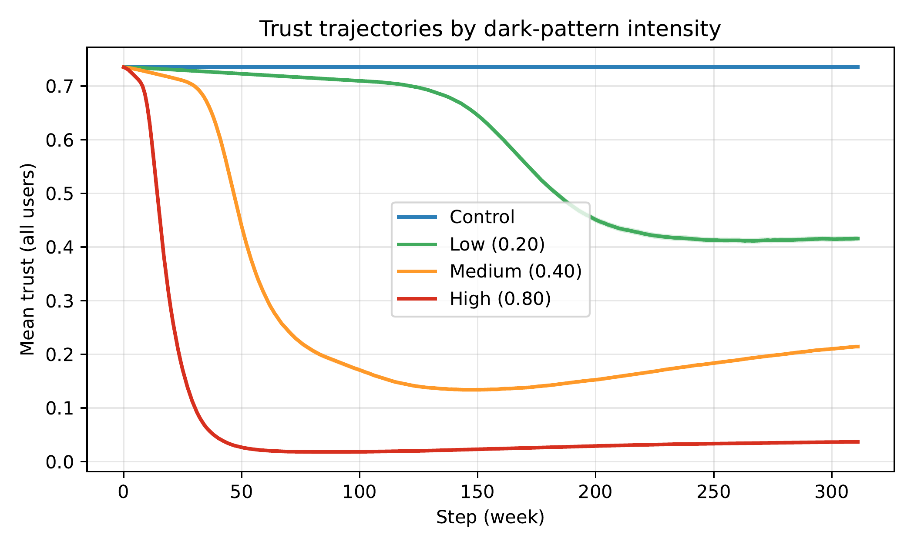
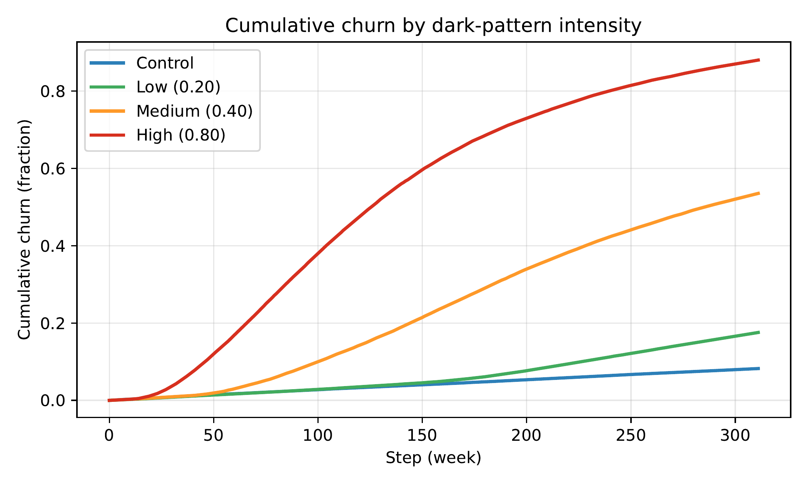
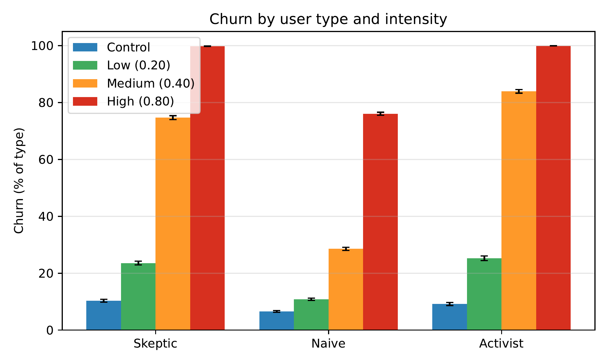
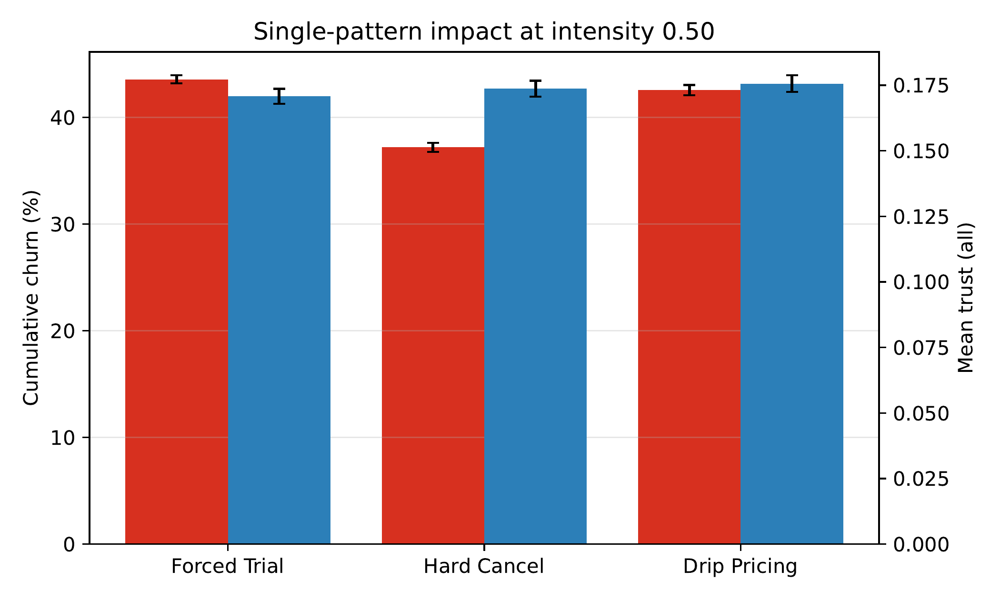
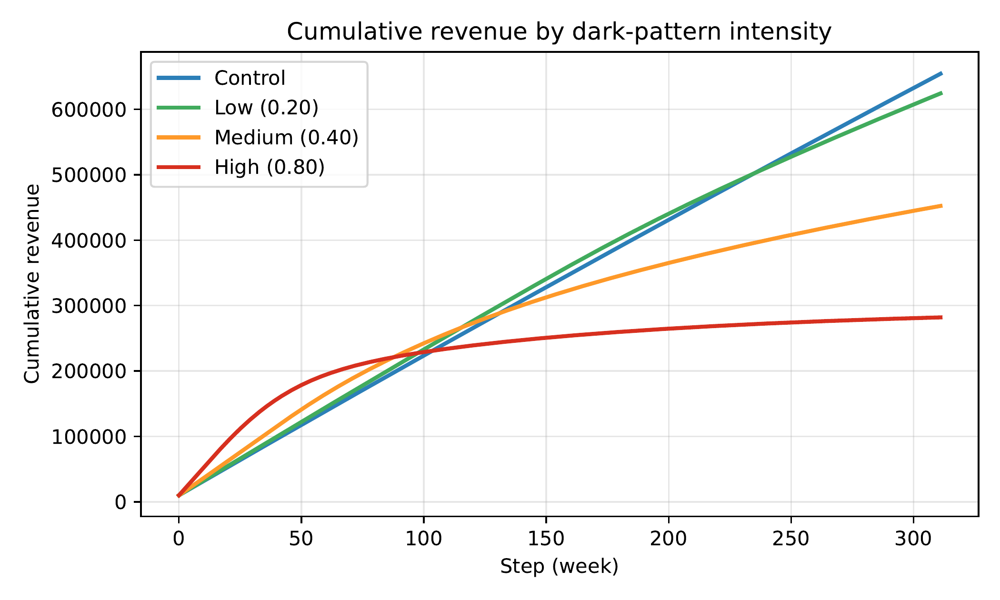
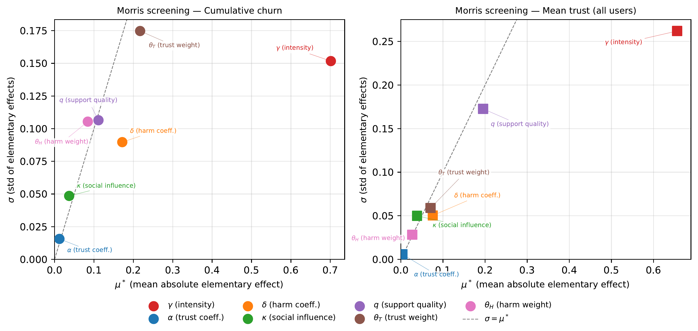

<!-- _class: title -->
<!-- _paginate: false -->
<!-- _footer: '' -->

Agent-Based Modeling · Technology in Society

# Dark Patterns as a Value-Destroying Strategy

## An Agent-Based Network Model of Trust, Social Contagion, and Platform Sustainability

<strong>Darko Etinger</strong> &nbsp;·&nbsp; <strong>Dejana Pivac</strong>

Faculty of Informatics, Juraj Dobrila University of Pula, Croatia

---

## Agenda

1. **The problem** — dark patterns are everywhere, and they work
2. **The gap** — nobody has modeled the *long-run* systemic effect
3. **The model** — a network-based agent-based simulation
4. **The results** — six years of simulated trust erosion
5. **The takeaways** — tipping points, vulnerability, and policy

Central question: if dark patterns boost short-term conversions, do they actually pay off for a platform over years — or do they quietly destroy it?

---

<!-- _class: divider -->
<!-- _footer: '' -->

Part 1

# The Problem

---

## Dark patterns are the norm, not the exception

1,818

dark pattern instances found across 11,000 shopping sites (Mathur et al. 2019)

~95%

of 240 popular mobile apps contain at least one dark pattern (Di Geronimo et al. 2020)

~2–4×

increase in unwanted sign-ups from mild → aggressive dark patterns (Luguri &amp; Strahilevitz 2021)

Deceptive interfaces exploit framing effects, scarcity illusions, social proof, and anchoring — steering users into purchases, data disclosure, and subscriptions they would not otherwise choose.

---

## The research gap

Existing research is <strong>predominantly static</strong>: cross-sectional detection and classification, or one-shot experiments measuring immediate response.

**What's missing:**
- How dark patterns interact with **social networks** over time
- How harm **accumulates** and **spreads** via word-of-mouth
- Whether "profitable" dark patterns are actually **sustainable**
- *At what intensity* systemic harm begins

No prior model couples a platform's strategic design choices, heterogeneous user behavior, **and** the resulting trust–economy feedback loop in one computational framework.

---

## This paper's contribution

**1. A network-based ABM**
Simulates 6 years of trust, harm, churn, word-of-mouth, reputation, and platform economics under dark-pattern deployment.

**2. Four formal tipping points**
Quantitative detectors for qualitative regime shifts in platform health.

**3. Systematic scenario analysis**
100 random seeds × 7 scenarios reveal a **non-linear, threshold-dependent** relationship between intensity and sustainability.

Headline finding: <strong>no safe deployment level exists</strong> — even mild dark patterns cross regime boundaries.

---

<!-- _class: divider -->
<!-- _footer: '' -->

Part 2

# The Model

---

## Model overview

- **500** heterogeneous user agents
- Connected via a **small-world social network** (Watts–Strogatz)
- **1** platform agent deploying up to 3 dark patterns
- **1 step = 1 week** → 312 steps ≈ **6 years**
- Built in **Mesa** (Python ABM framework)

**Each weekly step:**

Exposure → Detection → Harm

Negative word-of-mouth

Recovery (support + natural)

Churn decisions

Platform adapts, economics update

---

## Three user archetypes

| Type | Share | Key traits |
|---|---|---|
| **Naive** | 50% | High baseline trust, low digital literacy, low manipulation sensitivity, **high switching cost**, elevated trust resilience |
| **Skeptic** | 30% | Moderate trust, high digital literacy, higher manipulation sensitivity, lower switching cost |
| **Activist** | 20% | Moderate trust, **highest** manipulation sensitivity, **lowest** switching cost, high social activity |

Traits are sampled from Beta(5,5) distributions scaled to type-specific ranges — bell-shaped variation around each type's midpoint, not a single universal distribution.

---

## Three dark patterns modeled

| Pattern | Models | Detectability | Base harm |
|---|---|---|---|
| **Forced Trial** | Forced conversions / upsells after a "free" trial | Moderate | Moderate |
| **Hard Cancellation** | Obstruction-based subscriber retention | **Highest** | Moderate |
| **Drip Pricing** | Hidden fees revealed late in checkout | Moderate | **Highest** |

All three share a single global <strong>dark-pattern intensity</strong> dial (0–1). Trust loss and harm accumulate per exposure, with per-step caps and a 3-exposure "habituation" ramp so shocks build gradually rather than instantly.

---

## Four formal tipping points

Each requires **5 consecutive steps** past threshold to trigger — filtering noise from genuine regime shifts.

| Tipping point | Trigger condition |
|---|---|
| **Trust Collapse** | Mean trust of active users ≤ 0.50 |
| **Social Contagion** | Negative word-of-mouth rate ≥ 0.22 |
| **Churn Cascade** | Cumulative churn ≥ 0.35 |
| **Extractive Divergence** | Revenue gap ≥ 20% of short-term revenue **and** churn ≥ 0.15 |

These operationalize qualitative "platform health" shifts that are hard to observe empirically but emerge clearly in simulation.

---

## Experimental setup

500

simulated users

312

weekly steps (~6 years)

100

random seeds per scenario

7

scenarios compared

**Scenarios:** Control (no dark patterns) · Low (0.20) · Medium (0.40) · High (0.80) — all three patterns active — plus three **single-pattern** scenarios at intensity 0.50 to isolate each pattern's individual effect.

All results regenerated end-to-end from an open replication package; unit-tested exposure–harm pipeline and tipping-point detectors.

---

<!-- _class: divider -->
<!-- _footer: '' -->

Part 3

# Results

---

## Outcomes across intensity levels

Table 1 · 312 steps · N = 500 · 100 seeds · mean ± 95% CI

| Metric | Control | Low (0.20) | Medium (0.40) | High (0.80) |
|---|---|---|---|---|
| Cumulative churn | 8.2 ± 0.2% | 17.6 ± 0.3% | 53.5 ± 0.5% | **88.0 ± 0.3%** |
| Mean trust (all) | 0.735 | 0.416 | 0.214 | **0.037** |
| Platform reputation | 74.3 | 46.8 | 18.4 | **2.0 (floor)** |
| Cumulative revenue | 654,255 | 624,184 | 452,232 | 281,916 |
| Opportunity cost | 29,079 | 59,151 | 231,103 | 401,419 |
| Tipping points (of 4) | 0.00 | 1.95 | **4.00** | **4.00** |

Even <strong>low</strong> intensity (0.20) crosses Trust Collapse and Extractive Divergence — while revenue looks almost untouched.

---

<!-- _class: figure -->

## Trust collapses well before revenue visibly suffers

Mean trust (all users) over time by dark-pattern intensity; shaded bands = 95% CI across 100 seeds.

---

<!-- _class: figure -->

## Churn accelerates sharply with intensity

Cumulative churn over time by dark-pattern intensity (mean ± 95% CI).

---

## Who leaves — and who stays trapped

Table 2 · Churn by user type · 100 seeds

| User type | Control | Low (0.20) | Medium (0.40) | High (0.80) |
|---|---|---|---|---|
| **Skeptic** (N=150) | 10 ± 1% | 24 ± 1% | **75 ± 1%** | 100% |
| **Naive** (N=250) | 7 ± 0% | 11 ± 0% | **29 ± 1%** | 76 ± 1% |
| **Activist** (N=100) | 9 ± 1% | 25 ± 1% | **84 ± 1%** | 100% |

Skeptics and activists exit fast. <strong>Naive users stay</strong> — high switching costs trap them on a deteriorating platform even as trust collapses around them.

---

<!-- _class: figure -->

## Churn by user type and intensity

Percent of each user type churned, by scenario (mean ± 95% CI).

---

## Not all dark patterns are equally harmful

Table 3 · Single-pattern impact at intensity 0.50 · 100 seeds

| Metric | Forced Trial | Drip Pricing | Hard Cancel |
|---|---|---|---|
| Cumulative churn | **43.5%** | 42.5% | 37.2% |
| Mean trust (all) | 0.171 | 0.176 | 0.174 |
| Tipping points (of 4) | **3.86** | 3.38 | 2.79 |

<strong>Counter-intuitive finding:</strong> Hard Cancellation is the most obstructive pattern but the <em>least</em> damaging overall — because it's the easiest to detect. Users notice fast and leave before harm accumulates. <strong>Higher detectability shortens the exposure window and limits systemic harm.</strong>

---

<!-- _class: figure -->

## Per-pattern churn and residual trust

Single-pattern impact at intensity 0.50: cumulative churn and residual trust (mean ± 95% CI).

---

<!-- _class: figure -->

## Revenue: early extraction, long-run losses

Cumulative revenue over time by dark-pattern intensity (mean ± 95% CI). Dark-pattern extraction front-loads revenue; falling reputation and churn erode it over the long run.

---

## Sensitivity analysis: what actually drives the outcome?

Table 4 · Morris elementary-effects screening · 360 model runs

| Parameter | μ\* churn | μ\* trust |
|---|---|---|
| **γ — dark pattern intensity** | **0.701** | **0.656** |
| θ_T — churn trust weight | 0.217 | 0.071 |
| δ — exposure-to-harm coeff. | 0.172 | 0.076 |
| q — support quality | 0.111 | 0.195 |
| θ_H — churn harm weight | 0.084 | 0.027 |
| κ — social influence | 0.037 | 0.038 |
| α — exposure-to-trust coeff. | 0.012 | 0.004 |

Intensity's effect is <strong>3.2–3.4× larger</strong> than any other parameter — and every signed effect points the expected direction across all 7 parameters tested simultaneously.

---

<!-- _class: figure -->

## Robust across simultaneous parameter perturbation

μ* vs. σ for cumulative churn (circles) and mean trust (squares). Points far right = most influential; above the diagonal = interaction-dominated.

---

<!-- _class: divider -->
<!-- _footer: '' -->

Part 4

# Discussion

---

## The self-reinforcing destruction loop

Dark Pattern Intensity

→

Exposure

→

Harm

→

Trust Erosion

↓ social contagion feedback ↓

Revenue Loss

←

Reputation

←

Churn

←

Negative WOM

Negative WOM feeds back and erodes trust even among <strong>unexposed</strong> users (dashed loop) — accelerating every downstream stage. A strategy that looks profitable early destroys more value than it captures over the long run.

---

## Heterogeneous vulnerability and lock-in

**Who is harmed most is not who leaves.**

- Naive users accumulate the **most cumulative harm** — precisely because high switching costs trap them
- Activists churn fastest but **amplify harm via WOM** before exiting
- As savvy users leave, aggregate complaint volume can **fall** — even as remaining users suffer more

A regulator watching aggregate complaint rates or reputation scores could see an <strong>apparent improvement</strong> at the exact moment the most vulnerable users are experiencing the worst conditions.

Vulnerability here is <strong>situational</strong>, not demographic — invisible to standard protected-group frameworks.

---

## Policy implications

**1. Regulate intensity, not just presence.**
Non-linear, threshold-dependent harm favors graduated limits (like emission caps) over binary bans — intensity monitoring over incident-by-incident adjudication.

**2. Treat dark patterns as a public harm.**
Negative WOM damages users never directly exposed — an externality that individual-consent/redress frameworks aren't built to address.

**3. Mandate Extractive Divergence disclosure.**
A platform-economics metric platforms already track internally — a candidate "leverage ratio" for systemic-risk monitoring, ahead of reputational collapse.

---

## Limitations

- Parameters are **literature-informed, not empirically fitted** — results are directional/qualitative, not point forecasts
- **Single platform, no competition** — a deliberate scoping choice; likely a **conservative lower bound** on real-world churn
- Does **not model** regulatory intervention, media coverage, or legal consequences
- **Static network structure** across the simulation horizon

Claims are conditional: they describe what follows <em>given</em> the modeled mechanisms — the robust part is the direction, ordering, and relative magnitude of effects, confirmed under Morris screening and alternate network topologies.

---

## Conclusion

<strong>No safe deployment level exists within the modeled regime.</strong> Even low-intensity dark patterns cross qualitative regime boundaries and inflict persistent trust damage that is nearly invisible on a revenue dashboard.

- Harm is not contained to individual moments of manipulation — it **propagates through social networks** and **destabilizes platform economics**
- Trust Collapse triggers first and consistently → candidate **early-warning indicator**
- Extractive Divergence grounds regulatory monitoring in **economics platforms already track**

**Future work:** empirical calibration · multi-platform competition · adaptive regulatory dynamics (media, penalties)

---

<!-- _class: title -->
<!-- _paginate: false -->
<!-- _footer: '' -->

# Thank you

## Questions & discussion

Darko Etinger · darko.etinger@unipu.hr 
Dejana Pivac · dpivac@unipu.hr

Faculty of Informatics, Juraj Dobrila University of Pula, Croatia 
Code, data & replication package: github.com/detinger/dark-patterns-ABM

